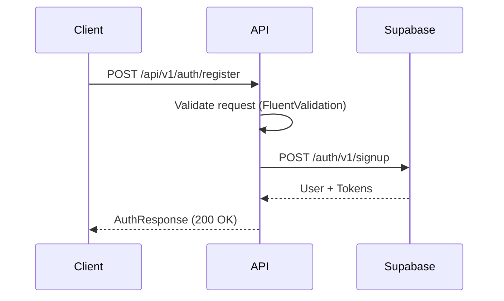
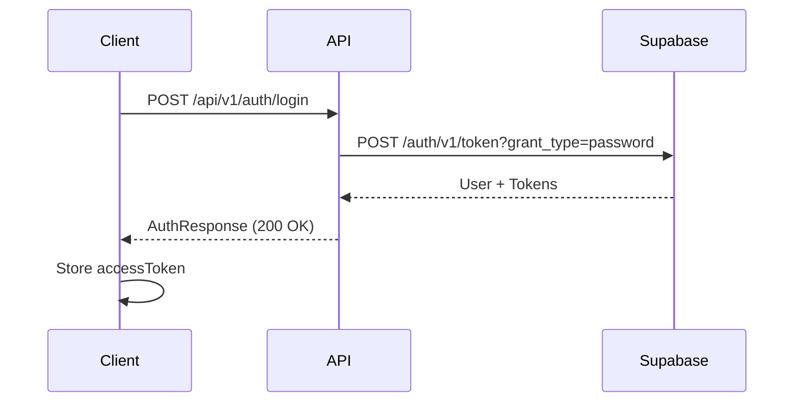
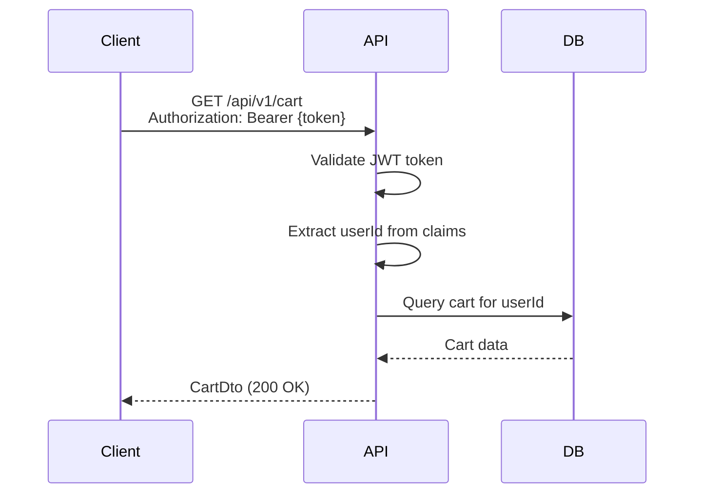
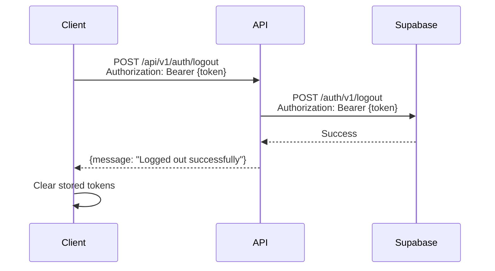

# Authentication API Documentation

## Overview

This API provides authentication endpoints that proxy requests to Supabase Auth. All endpoints return JWT tokens for subsequent API calls.

## Endpoints

### 1. Register New User

**Endpoint:** `POST /api/v1/auth/register`

**Request Body:**
```json
{
  "email": "user@example.com",
  "password": "SecurePass123!",
  "fullName": "John Doe" // Optional
}
```

**Password Requirements:**
- Minimum 8 characters
- At least one uppercase letter
- At least one lowercase letter
- At least one digit

**Success Response (200 OK):**
```json
{
  "accessToken": "eyJhbGciOiJIUzI1NiIsInR5cCI6IkpXVCJ9...",
  "refreshToken": "v1.MQ.abc123...",
  "expiresIn": 3600,
  "tokenType": "bearer",
  "user": {
    "id": "66c37b1f-e772-4cf4-b8c2-8ad80782b78a",
    "email": "user@example.com",
    "fullName": "John Doe",
    "phone": null,
    "createdAt": "2025-10-13T10:00:00Z",
    "lastSignInAt": "2025-10-13T10:00:00Z",
    "appRole": null
  }
}
```

**Error Response (400 Bad Request):**
```json
{
  "error": "Registration failed",
  "message": "User already registered"
}
```

---

### 2. Login

**Endpoint:** `POST /api/v1/auth/login`

**Request Body:**
```json
{
  "email": "user@example.com",
  "password": "SecurePass123!"
}
```

**Success Response (200 OK):**
```json
{
  "accessToken": "eyJhbGciOiJIUzI1NiIsInR5cCI6IkpXVCJ9...",
  "refreshToken": "v1.MQ.abc123...",
  "expiresIn": 3600,
  "tokenType": "bearer",
  "user": {
    "id": "66c37b1f-e772-4cf4-b8c2-8ad80782b78a",
    "email": "user@example.com",
    "fullName": "John Doe",
    "phone": null,
    "createdAt": "2025-10-13T10:00:00Z",
    "lastSignInAt": "2025-10-13T10:15:00Z",
    "appRole": "admin"
  }
}
```

**Error Response (400 Bad Request):**
```json
{
  "error": "Login failed",
  "message": "Invalid email or password"
}
```

---

### 3. Get Current User

**Endpoint:** `GET /api/v1/auth/me`

**Headers:**
```
Authorization: Bearer {accessToken}
```

**Success Response (200 OK):**
```json
{
  "id": "66c37b1f-e772-4cf4-b8c2-8ad80782b78a",
  "email": "user@example.com",
  "fullName": "John Doe",
  "phone": null,
  "createdAt": "2025-10-13T10:00:00Z",
  "lastSignInAt": "2025-10-13T10:15:00Z",
  "appRole": "admin"
}
```

**Error Response (401 Unauthorized):**
```json
{
  "type": "https://tools.ietf.org/html/rfc9110#section-15.5.2",
  "title": "Unauthorized",
  "status": 401
}
```

**Error Response (404 Not Found):**
```json
{
  "error": "User not found"
}
```

---

### 4. Logout

**Endpoint:** `POST /api/v1/auth/logout`

**Headers:**
```
Authorization: Bearer {accessToken}
```

**Success Response (200 OK):**
```json
{
  "message": "Logged out successfully"
}
```

**Error Response (401 Unauthorized):**
```json
{
  "type": "https://tools.ietf.org/html/rfc9110#section-15.5.2",
  "title": "Unauthorized",
  "status": 401
}
```

**Error Response (400 Bad Request):**
```json
{
  "error": "Logout failed"
}
```

---

## Usage Flow

### 1. Registration Flow



### 2. Login Flow



### 3. Authenticated Request Flow



### 4. Logout Flow



---

## Error Handling

### Common Error Codes

| Status Code | Meaning | Common Causes |
|-------------|---------|---------------|
| 400 | Bad Request | Invalid input, validation errors, user already exists |
| 401 | Unauthorized | Invalid/expired token, wrong credentials |
| 404 | Not Found | User not found in Supabase |
| 500 | Internal Server Error | Supabase API error, network issues |

### Validation Errors

FluentValidation returns structured error responses:

```json
{
  "type": "https://tools.ietf.org/html/rfc9110#section-15.5.1",
  "title": "One or more validation errors occurred.",
  "status": 400,
  "errors": {
    "Password": [
      "Password must be at least 8 characters",
      "Password must contain at least one uppercase letter"
    ]
  }
}
```

---

## Token Management

### Access Token
- **Type:** JWT Bearer token
- **Expiry:** 3600 seconds (1 hour)
- **Usage:** Include in `Authorization` header for all protected endpoints
- **Format:** `Authorization: Bearer {accessToken}`

### Refresh Token
- **Type:** Opaque string
- **Expiry:** Longer than access token (Supabase default: 30 days)
- **Usage:** Not implemented in current API (future feature)
- **Note:** Store securely, never expose in logs

### Token Storage (Client-side Recommendations)

**Web Applications:**
- Store `accessToken` in memory or sessionStorage
- Store `refreshToken` in httpOnly cookie (if refresh endpoint added)
- Never store in localStorage (XSS vulnerability)

**Mobile Applications:**
- Use secure storage (iOS Keychain, Android Keystore)

---

## Configuration

### Required Settings in `appsettings.json`

```json
{
  "Supabase": {
    "Url": "https://your-project.supabase.co",
    "AnonKey": "your-anon-key-here"
  },
  "SupabaseAuth": {
    "JwtIssuer": "https://your-project.supabase.co/auth/v1",
    "JwtAudience": "authenticated",
    "JwtSecret": "your-jwt-secret"
  }
}
```

### Getting Supabase Credentials

1. Go to **Supabase Dashboard** → Your Project
2. **Settings** → **API**
3. Copy:
   - **Project URL** → `Supabase:Url`
   - **anon public** key → `Supabase:AnonKey`
   - **JWT Secret** → `SupabaseAuth:JwtSecret`

---

## Testing

### Using VS Code REST Client

See [`auth-test.http`](../auth-test.http) for ready-to-use HTTP requests.

### Using cURL

**Register:**
```bash
curl -X POST https://localhost:7188/api/v1/auth/register \
  -H "Content-Type: application/json" \
  -d '{"email":"test@example.com","password":"Test1234!","fullName":"Test User"}'
```

**Login:**
```bash
curl -X POST https://localhost:7188/api/v1/auth/login \
  -H "Content-Type: application/json" \
  -d '{"email":"test@example.com","password":"Test1234!"}'
```

**Get User Info:**
```bash
curl -X GET https://localhost:7188/api/v1/auth/me \
  -H "Authorization: Bearer YOUR_ACCESS_TOKEN"
```

**Logout:**
```bash
curl -X POST https://localhost:7188/api/v1/auth/logout \
  -H "Authorization: Bearer YOUR_ACCESS_TOKEN"
```

---

## Security Considerations

### ✅ Implemented
- Password complexity validation (8+ chars, upper/lower/digit)
- JWT token validation on protected endpoints
- HTTPS enforcement (configured in middleware)
- CORS policy restricts frontend origins
- Rate limiting via `AspNetCoreRateLimit`

### ⚠️ Recommendations
- Implement refresh token rotation
- Add email verification flow
- Add password reset flow
- Implement account lockout after failed attempts
- Add 2FA support
- Log authentication events for audit

---

## Troubleshooting

### "Supabase:Url missing" or "Supabase:AnonKey missing"

**Cause:** Missing configuration in `appsettings.json`

**Fix:** Add Supabase credentials to config file.

### "Registration failed: User already registered"

**Cause:** Email already exists in Supabase

**Fix:** Use different email or implement "forgot password" flow.

### "Login failed: Invalid email or password"

**Cause:** Wrong credentials or user doesn't exist

**Fix:** Verify credentials or register new account.

### 401 Unauthorized on `/api/v1/auth/me`

**Cause:** Invalid, expired, or missing JWT token

**Fix:** 
1. Check token is included: `Authorization: Bearer {token}`
2. Verify token hasn't expired (1 hour default)
3. Re-login to get fresh token

---

## Future Enhancements

- [ ] Refresh token endpoint
- [ ] Email verification
- [ ] Password reset flow
- [ ] Update profile endpoint
- [ ] Change password endpoint
- [ ] OAuth providers (Google, GitHub)
- [ ] 2FA/MFA support
- [ ] Session management
- [ ] Device tracking
